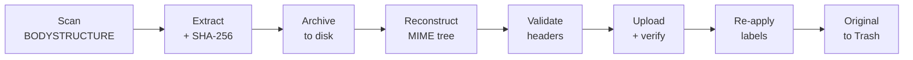

# Gmail Clean and Backup

A Python CLI that reclaims Google account storage by **removing large attachments from old Gmail messages while keeping the emails themselves intact** — the sender, subject, body, date, threading and labels all survive. Every attachment is downloaded, hashed and filed into a local archive *before* anything is changed in the mailbox, and the original message stays recoverable from Gmail's Trash.

The result: your mail history stays searchable and readable, your attachments live on a drive you control, and the gigabytes go back to your quota.

---

## The problem

Google counts Gmail attachments against the same 15 GB shared with Drive and Photos. The built-in remedies are all-or-nothing:

| Google's option | What it costs you |
|---|---|
| `has:attachment larger:10M` → Delete | Loses the entire conversation — body, context, thread |
| Google Takeout | Exports everything, frees nothing |
| Buy more storage | A recurring bill for files from 2008 |

There is no native way to say *"keep the email, drop the 25 MB tarball, and put the tarball on my NAS."* That is what this tool does.

## What it does

For each matching message, the tool rebuilds the email from scratch without its attachment parts, substituting a plain-text placeholder that records where the file went:

```
[Attachment Removed]
Filename: presentation.pptx
Original Size: 12.4 MB
Backup Location: backups/documents/2014-03-21_presentation.pptx
```

The rebuilt message replaces the original in Gmail. Because the reconstruction preserves `Message-ID`, `In-Reply-To` and `References`, the message stays stitched into its thread; because labels are re-applied after upload, it stays where you filed it.



Each stage is journaled to an append-only transaction log, so an interrupted run can be resumed rather than restarted.

## Engineering notes

The interesting parts of this project are the ones that protect against data loss.

**Scanning is cheap.** Finding candidates never downloads a message. The scanner issues a single IMAP `FETCH` for `BODY[HEADER] BODYSTRUCTURE X-GM-MSGID X-GM-THRID X-GM-LABELS RFC822.SIZE` and parses the MIME tree description the server returns, so a mailbox of tens of thousands of messages can be surveyed on header traffic alone. Full bodies are pulled only for messages you actually process.

**Reconstruction is structural, not textual.** The tool walks the parsed MIME tree with Python's `email` package, drops parts whose `Content-Disposition` marks them as attachments, and re-serialises. Inline images referenced by HTML bodies (`Content-Disposition: inline`) are deliberately kept, so HTML mail doesn't end up full of broken image icons. Single-part messages, `multipart/alternative`, `multipart/related` and nested `multipart/mixed` are each handled on their own terms.

**Nothing is deleted until the replacement is proven.** Replacement is a seven-phase commit: fetch original → reconstruct → validate → `APPEND` the new message → re-fetch and verify the upload → re-apply labels → *only then* move the original to Trash. A failure at any phase aborts before the destructive step, and rollback deletes the partial upload.

**Validation is a hard gate.** Before upload, the reconstructed message is re-parsed from its serialised bytes and checked against the original: `Message-ID`, `Date`, `From`, `Subject`, `In-Reply-To` and `References` must match exactly, and the MIME structure must still be well-formed. Any mismatch fails that message and leaves the original untouched — in real-world use this gate is what caught a `References` header being rewritten during serialisation, on messages that would otherwise have been silently detached from their threads.

**Integrity is verifiable after the fact.** Every extracted attachment is SHA-256 hashed on the way to disk, and the digest is stored in the manifest alongside the message ID, thread ID, labels and byte sizes — so you can prove months later that an archived file is bit-identical to what left the mailbox.

**Interruptions are recoverable.** Every phase transition is appended to a JSONL transaction log. On restart, incomplete transactions are replayed from their last recorded state: a run that died after upload but before label restoration resumes at the label step rather than duplicating the message.

**Mistakes are reversible.** Because originals go to Trash rather than being expunged, `revert` can locate an original by `Message-ID`, restore it to All Mail with its labels, and remove the stripped copy — for as long as Gmail retains the Trash (about 30 days).

**Credentials are encrypted at rest.** OAuth tokens are sealed with Fernet using a key derived by PBKDF2-HMAC-SHA256 at 480,000 iterations (the OWASP recommendation), so `token.enc` is not a plaintext bearer credential sitting in the project directory.

> Used against a real 20-year personal archive: 273 messages processed, ~2.4 GB reclaimed, no broken threads. The handful of failures were refusals by the validation gate — which is the gate working.

---

## Quick start

```bash
git clone https://github.com/mwilczynska/gmail-clean-and-backup.git
cd gmail-clean-and-backup
pip install -e .
```

You need Python 3.10+ and OAuth credentials from a Google Cloud project — see [setup](#google-cloud-setup) below.

```bash
# 1. Authenticate once — opens a browser, stores an encrypted token
gmail-clean auth --credentials credentials.json --email you@gmail.com

# 2. See what's eligible, without touching anything
gmail-clean scan --email you@gmail.com --min-size 5MB --before 2020-01-01

# 3. Preview the exact changes (dry run is the default)
gmail-clean process --email you@gmail.com --min-size 5MB --before 2020-01-01

# 4. Commit them
gmail-clean process --email you@gmail.com --min-size 5MB --before 2020-01-01 --no-dry-run
```

**Start small.** Add `--limit 5` to your first live run for a five-message trial, and confirm the results in Gmail before turning it loose on twenty years of mail.

## Commands

| Command | Purpose |
|---|---|
| `auth` | One-time OAuth2 flow; writes an encrypted `token.enc` |
| `scan` | Report on eligible messages without modifying anything (`--export` to CSV) |
| `process` | Extract, archive and strip attachments (**dry run unless `--no-dry-run`**) |
| `status` | Processing statistics and storage reclaimed to date |
| `revert` | Restore originals from Trash (`--list` to see what's still revertible) |
| `export-manifest` | Dump the processing manifest as JSON or CSV |
| `cleanup` | Prune old transaction logs and empty backup directories |

Filtering works the same way on `scan` and `process`: `--min-size 10MB` and `--before 2015-01-01`, where dates may be absolute (`YYYY-MM-DD`) or relative (`30d`, `6m`, `1y`). Both take `--limit N` to cap how many messages the run touches — the safest way to trial a change. `scan` additionally takes `--after` and `--export results.csv`; `process` takes `--batch-size N` (the per-run ceiling, default 50) and `--zip`. `--yes` skips confirmation prompts on `process`, `revert` and `cleanup`, and `--config path.yaml` works everywhere.

Run `gmail-clean <command> --help` for the full set.

## Where your attachments end up

By default files are grouped by type with a date prefix, which makes an archive you can actually browse:

```
backups/
├── images/      2005-04-09_vacation_photo.jpg
├── documents/   2006-03-20_report.pdf
├── audio/       2007-08-30_voicemail.mp3
├── video/       2011-05-22_clip.mp4
└── other/       2013-02-14_archive.zip
```

Set `organize_by` in your config to `date` (year/month/day/subject), `sender` (by domain and address) or `label` if you prefer a different shape. `manifest.json` records every processed message and the exact path, hash and size of each file extracted from it.

## Configuration

Copy `config.example.yaml` to `config.yaml` and edit. Every value has a CLI equivalent; the config file just saves you retyping them.

```yaml
gmail:
  email: "you@gmail.com"

backup:
  directory: "./backups"
  organize_by: "type"        # type | date | sender | label

processing:
  dry_run: true
  batch_size: 50
  skip_encrypted: true       # S/MIME and PGP cannot be safely rewritten
  preserve_inline_images: true
  min_attachment_size: 102400

safety:
  keep_trash_days: 30
  require_confirmation: true
```

`config.yaml`, `credentials.json`, `token.enc`, `manifest.json`, `backups/` and `logs/` are all gitignored — none of your mail or credentials can be committed by accident.

## Google Cloud setup

<details>
<summary>Creating OAuth credentials (one time, ~5 minutes)</summary>

The tool talks to Gmail over IMAP using OAuth2, so you need a Google Cloud project of your own. Nothing is billed; this stays inside the free tier.

1. **Create a project** — [Google Cloud Console](https://console.cloud.google.com/) → project dropdown → **New Project** → name it → **Create**, then select it.

2. **Enable the Gmail API** — **APIs & Services → Library**, search "Gmail API", **Enable**.

3. **Configure the consent screen** — **APIs & Services → OAuth consent screen**:
   - User type **External** (unless you're on Google Workspace) → **Create**
   - Fill in app name, user support email, developer contact
   - **Scopes** → **Add or Remove Scopes** → filter for `https://mail.google.com/` → check it → **Update**
   - **Test users** → **Add Users** → add the Gmail address you'll be using

   Leaving the app in "Testing" mode is correct for personal use. If you skip adding yourself as a test user, authentication will fail.

4. **Create credentials** — **APIs & Services → Credentials** → **Create Credentials → OAuth client ID** → application type **Desktop app** → **Create** → **Download JSON**, saved as `credentials.json` in the project directory.

5. **Authenticate**:

   ```bash
   gmail-clean auth --credentials credentials.json --email you@gmail.com
   ```

   A browser opens for sign-in; the resulting token is encrypted to `token.enc`. Access tokens expire hourly and are refreshed automatically — if a refresh ever fails, re-run `auth`.

**Why the full `https://mail.google.com/` scope?** Rewriting a message means appending a new one and deleting the old, which the narrower read-only and modify scopes do not permit.

</details>

## Project structure

```
src/
├── auth/        OAuth2 flow + PBKDF2/Fernet encrypted token storage
├── imap/        IMAP client (retry + reconnect), BODYSTRUCTURE scanner, Gmail search
├── processor/   extractor → backup → reconstructor → validator → replacer,
│                plus batch orchestration, transaction log, revert
├── models/      typed dataclasses for headers, attachments, results
├── utils/       SHA-256 hashing, TinyDB manifest, logging
└── cli/         Typer commands, Rich output, YAML config
```

## Limitations

- **Encrypted mail is skipped.** S/MIME and PGP messages are detected and left alone — rewriting them would break their signatures.
- **Gmail rate limits set the pace.** Expect roughly 5–10 seconds per message; this is a run-it-overnight tool, not an instant one.
- **Revert has a deadline.** Once Gmail purges the Trash (about 30 days), the original is gone for good. Your attachment backups are unaffected either way.
- **The replacement gets a new internal date.** Gmail's own received-timestamp for the rewritten message is the upload time; the `Date:` header — the one that is displayed and sorted on — is preserved.

## Development

```bash
pip install -e ".[dev]"

pytest                    # test suite
ruff check src/ tests/    # linting
mypy src/                 # type checking (strict: no untyped defs)
```

All three run clean on `main`. `mypy` is configured strictly (`disallow_untyped_defs`, `warn_return_any`), so the `imaplib` and `google-auth` boundaries — where the upstream stubs return `Any` — are handled with explicit narrowing and `cast`, not with blanket suppressions.

## Safety checklist

Before a large run:

- [ ] Dry run first and read the output — it lists exactly which messages and files are affected
- [ ] Process a small `--limit` run and confirm the results in Gmail
- [ ] Verify the backup files exist and open correctly
- [ ] Leave originals in Trash until you are confident

This tool modifies your mailbox. It is built to fail safe, but the checks above are still yours to run.

## Contributing

Issues and pull requests are welcome — please open an issue to discuss substantial changes first.

## License

MIT — see [LICENSE](LICENSE).
